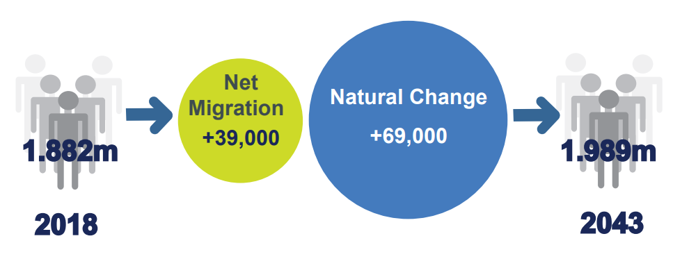

```{r infographics_settings, include=FALSE}
# Set chunk options for all chunks in this file.

knitr::opts_chunk$set(
  message = FALSE,
  warning = FALSE,
  echo = FALSE
)

library(here)

source(
  here(
    "code",
    "demo",
    "demo_data_prep.R"
  )
)
```


### Type the title of infographic here

Example infographic with 4 key statistics presented in a logical order from left
to right.
```{r, echo = TRUE, warnings = FALSE, fig.alt = "Population increase from 2018 to 2043 due to relative contributions of natural change and net migration.", out.width="100%"}
# file is in image folder

```

Source: 2019 Mid-year population estimates

#### Accessible infographics

* Explain the key message from the infographic in the report text.
* Add alt text so that screen reader users can understand the image. 
* If an image is only for decoration, use empty alt text.
* Do not put important text information in images, make sure it appears as text
in the report. 
* Use accessible colours and make sure text has good contrast against the
background.


For more help, see the Dissemination Branch guide [Creating an accessible infographic](https://nicsonline.sharepoint.com/:u:/s/TM-DOF-NISRATEAM/IQAVFYCBi8ZWR64U9kMdk2DcAUfVs_bFTnc1OrObMxVnyrA?e=dU9Uyb).
You can also use the [Government Analysis Function guide to infographics](https://gss.civilservice.gov.uk/policy-store/infographics/). 

**Important**: If you use SVG images with text, check if screen readers can read
the text. You can test this using Microsoft Narrator. If it does announce the
words in the image, ensure it makes sense to users. If not, you can use a PNG
and add alt text.
